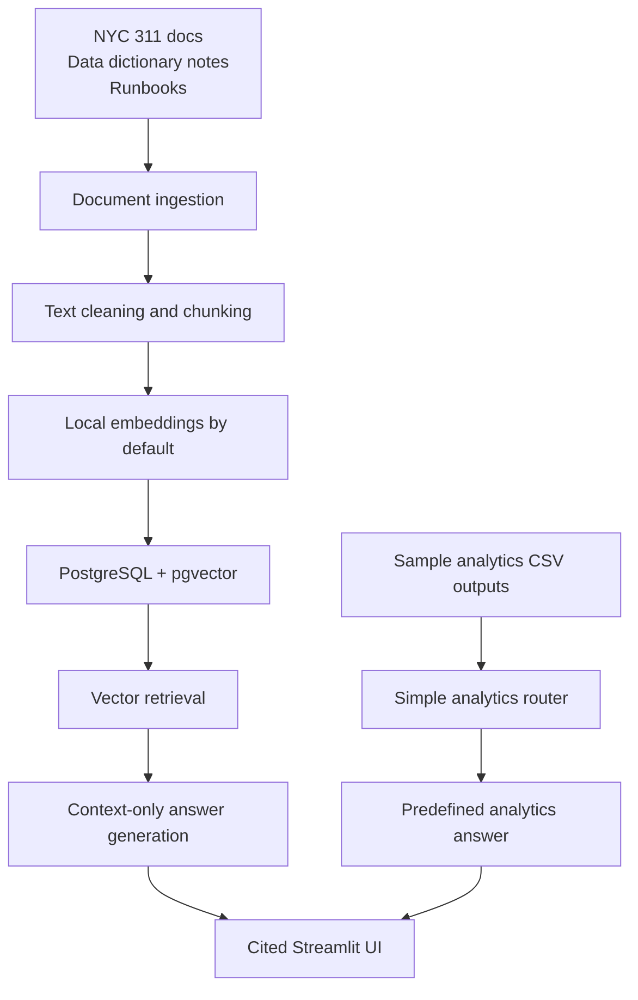

# CivicLens RAG - NYC 311 Operations Copilot

[](https://github.com/rihua-tech/civiclens-rag-nyc311/actions/workflows/ci.yml)

CivicLens RAG is a local AI Data Engineering / Hybrid RAG portfolio project that extends an NYC 311 Lakehouse concept with cited document search, PostgreSQL + pgvector retrieval, simple predefined analytics summaries, and a local Streamlit UI.

The project is designed to show how an operational data platform can pair documentation retrieval with lightweight analytics answers while keeping outputs grounded, cited, and honest about current limitations.

## Why This Project Matters

This project demonstrates:

- Data engineering foundation: ingestion, chunking, embeddings, SQL schema, Dockerized Postgres, and local validation.
- RAG pipeline design: curated documents become searchable chunks with source metadata and citations.
- Vector database usage: PostgreSQL + pgvector stores and retrieves embedded chunks.
- Metadata and citations: answers preserve source paths and chunk identifiers for review.
- Evaluation thinking: a small evaluation set checks RAG answers, citations, analytics routing, and safe no-answer behavior.
- Local app demo: Streamlit provides a simple browser interface for document questions and predefined analytics questions.
- Honest limitations: this is local, not deployed, not connected to live NYC 311 data, and not a production text-to-SQL agent.

## Architecture



## Data Sources

The first MVP uses a small curated set of local source documents and sample analytics outputs:

- Project README and design docs
- Data source notes and data dictionary context
- RAG design and evaluation notes
- Small sample CSV outputs in `data/sample_outputs/`

The project does not ingest millions of raw NYC 311 records into the vector database. Structured metrics stay in SQL examples or small sample CSV outputs instead of being dumped into vector storage.

## How RAG Works

1. Local source documents are loaded into a processed document store.
2. Text is cleaned and split into chunks with metadata.
3. Embeddings are generated locally by default with a deterministic embedding function.
4. Chunks and embeddings are stored in PostgreSQL + pgvector.
5. A user question is embedded with the same local embedding path.
6. Relevant chunks are retrieved from pgvector.
7. A context-only answer is generated from retrieved chunks.
8. The UI displays the answer, source citations, and an optional retrieved chunk preview.

OpenAI-backed embeddings or answers are optional and disabled by default.

## Hybrid RAG Design

CivicLens uses a simple hybrid pattern:

- Documentation questions use vector retrieval over curated project documents.
- Simple analytics questions use predefined sample CSV outputs.
- The analytics path is a small keyword router, not a production text-to-SQL agent.

This keeps the local demo predictable and offline-friendly while still showing how RAG and analytics can work together in an operations copilot.

## Database Schema

The local PostgreSQL schema includes:

- `documents`: source document metadata such as document ID, source name, type, path, and ingestion timestamp.
- `chunks`: chunk text, source metadata, token counts, and pgvector embeddings.
- `queries`: a table reserved for logging user questions in future local experiments.
- `retrieval_results`: a table reserved for storing retrieved chunk metadata and scores in future evaluation work.

## Local Setup

Create a local `.env` from `.env.example` if you need to override defaults. Do not commit `.env`.

```bash
docker compose up -d
python -m src.ingestion.load_documents
python -m src.chunking.chunk_documents
python -m src.embeddings.embed_chunks
python -m src.evaluation.evaluate_rag
streamlit run app/streamlit_app.py
python -m pytest -q
python -m compileall app src tests
```

`docker-compose.yml` starts PostgreSQL with pgvector using safe local defaults. The local evaluation command requires the database-backed retrieval path to be prepared with ingestion, chunking, and embeddings.

## Example Questions

- What is the NYC 311 Lakehouse architecture?
- What is the no-answer rule?
- What are the top complaint types?
- Which borough has the highest complaint volume?
- What does complaint_type mean?
- What is a random unsupported question?

## Evaluation Summary

Local evaluation currently uses 18 questions from `data/evaluation/rag_test_questions.csv`.

Most recent local validation:

- 18/18 evaluation questions passed locally.
- Unit tests passed locally.
- Evaluation covers document/RAG answers, citation coverage, analytics routing, safe no-answer behavior, and raw markdown clutter checks.

This is a basic local regression check, not a production reliability benchmark.

## CI

GitHub Actions runs offline-safe checks only:

```bash
python -m pytest -q
python -m compileall app src tests
```

CI does not require Docker, `.env`, OpenAI credentials, a live database, external APIs, or raw NYC 311 datasets.

## Screenshots

Screenshots will be added after final local UI capture. No screenshot files are referenced yet.

## Limitations

- Local project only.
- Not deployed.
- Not connected to live NYC 311 data.
- No default OpenAI calls.
- Simple analytics router, not production text-to-SQL.
- Small curated documents and sample outputs only.
- Evaluation is lightweight and does not use an LLM judge.

## Future Work

- Add a production-style API layer.
- Expand the curated document collection.
- Improve evaluation coverage and scoring.
- Optionally support real OpenAI embeddings or answers.
- Add a hosted UI when deployment work is in scope.
- Build a richer analytics layer beyond predefined sample outputs.

## Tech Stack

- Python
- Streamlit
- PostgreSQL
- pgvector
- Docker
- SQL
- pytest
- GitHub Actions
- Optional OpenAI API integration, disabled by default

## Repository Structure

```text
civiclens-rag-nyc311/
|-- app/
|   `-- streamlit_app.py
|-- data/
|   |-- evaluation/
|   |-- processed/
|   |-- raw/
|   `-- sample_outputs/
|-- docs/
|   |-- architecture.md
|   |-- data-sources.md
|   |-- evaluation-notes.md
|   |-- portfolio-card.md
|   `-- rag-design.md
|-- sql/
|   |-- sample_queries.sql
|   `-- schema.sql
|-- src/
|   |-- analytics/
|   |-- chunking/
|   |-- common/
|   |-- embeddings/
|   |-- evaluation/
|   |-- generation/
|   |-- ingestion/
|   `-- retrieval/
|-- tests/
|-- docker-compose.yml
|-- requirements.txt
`-- README.md
```
