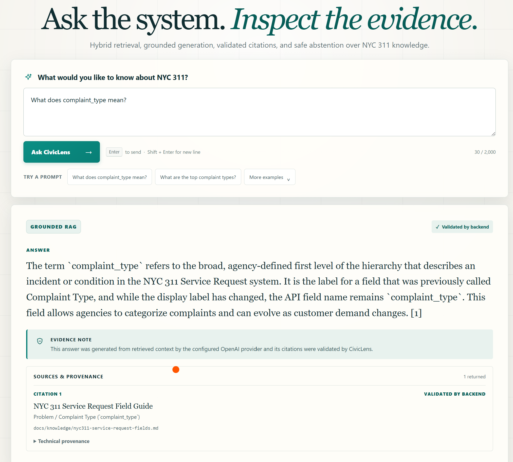
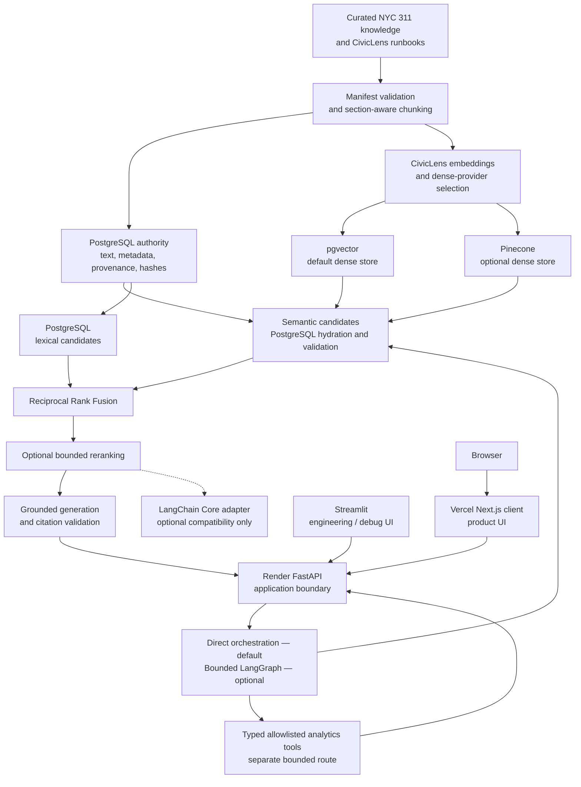

# CivicLens RAG - NYC 311 Operations Copilot

[](https://github.com/rihua-tech/civiclens-rag-nyc311/actions/workflows/ci.yml)

## What is CivicLens?

CivicLens is an AI-powered NYC 311 knowledge assistant that answers documentation questions from retrieved evidence, returns validated citations, and safely abstains when evidence is insufficient. Its product stack combines a Next.js interface, FastAPI application boundary, hybrid RAG, and PostgreSQL + pgvector.

The project emphasizes traceable ingestion, measurable retrieval, reproducible evaluation, citation safety, and bounded sample analytics. It is intentionally a non-production AI Engineering / RAG Engineering portfolio system, not a live municipal service.

## Live Demo / Hosted Proof

**Try CivicLens:** <https://civiclens-rag-nyc311.vercel.app>



The browser calls Render FastAPI directly. Grounded RAG answers use retrieved evidence and CivicLens-owned citation validation; approved analytics reads checked-in sample CSV outputs; unsupported questions abstain with zero fabricated sources.

[View Approved Analytics proof](docs/screenshots/issue20-vercel-analytics.png) · [View Safe Abstention proof](docs/screenshots/issue20-vercel-safe-abstention.png)

The hosted deployment is non-production and may pause while its Render backend cold-starts.

## Proof at a Glance

- **Traceable knowledge:** a version-controlled manifest validates normalized hashes, provenance, stable document IDs, and section-aware chunk IDs.
- **Hybrid retrieval:** dense semantic and PostgreSQL full-text candidates are fused with deterministic Reciprocal Rank Fusion (RRF), with optional bounded reranking.
- **Measured performance:** on the approved 14-question real-local retrieval subset, hybrid search reached `0.8393` Recall@5 and `0.9286` expected-source retrieval.
- **Grounded and safe answers:** generation receives allowlisted evidence; application-owned validation rejects fabricated citations and safely abstains when evidence is insufficient.
- **Bounded AI workflows:** four typed, allowlisted, read-only analytics tools share the FastAPI boundary with document RAG; direct orchestration is default and bounded LangGraph is optional.
- **Runnable and auditable:** Next.js and Streamlit consume the versioned API contract, while Docker and isolated CI paths provide reproducible application and delivery proof.

## Architecture

The hosted product path keeps RAG and approved analytics separate:

```text
Browser
  ↓
Vercel Next.js
  ↓
Render FastAPI
  ↓
CivicLens orchestration
  ├─ Hybrid RAG → PostgreSQL + pgvector
  └─ Approved Analytics → checked-in sample CSV outputs
```

Next.js is a presentation client only; Render FastAPI remains the AI application boundary. The hosted RAG configuration uses Sentence Transformers embeddings, hybrid retrieval, and `ANSWER_PROVIDER=openai` for grounded generation. OpenAI receives retrieved evidence, and CivicLens validates citations before returning the public answer.

<details>
<summary>View full technical architecture</summary>


```mermaid
flowchart TD
    sources["Curated NYC 311 knowledge<br/>and CivicLens runbooks"]
    ingestion["Manifest validation<br/>and section-aware chunking"]
    postgres["PostgreSQL authority<br/>text, metadata, provenance, hashes"]
    embeddings["CivicLens embeddings<br/>and dense-provider selection"]
    pgvector["pgvector<br/>default dense store"]
    pinecone["Pinecone<br/>optional dense store"]
    dense["Semantic candidates<br/>PostgreSQL hydration and validation"]
    lexical["PostgreSQL<br/>lexical candidates"]
    rrf["Reciprocal Rank Fusion"]
    rerank["Optional bounded reranking"]
    grounded["Grounded generation<br/>and citation validation"]
    fastapi["Render FastAPI<br/>application boundary"]
    orchestration["Direct orchestration — default<br/>Bounded LangGraph — optional"]
    analytics["Typed allowlisted analytics tools<br/>separate bounded route"]
    browser["Browser"]
    nextjs["Vercel Next.js client<br/>product UI"]
    streamlit["Streamlit<br/>engineering / debug UI"]
    langchain["LangChain Core adapter<br/>optional compatibility only"]

    sources --> ingestion
    ingestion --> postgres
    ingestion --> embeddings
    embeddings --> pgvector
    embeddings --> pinecone
    pgvector --> dense
    pinecone --> dense
    postgres --> dense
    postgres --> lexical
    fastapi --> orchestration
    orchestration --> dense
    orchestration --> analytics
    dense --> rrf
    lexical --> rrf
    rrf --> rerank
    rerank --> grounded
    grounded --> fastapi
    analytics --> fastapi
    browser --> nextjs
    nextjs --> fastapi
    streamlit --> fastapi
    rerank -.-> langchain
```

</details>

PostgreSQL remains authoritative for document/chunk text, metadata, provenance, hashes, corpus identity, and lexical retrieval. pgvector is the default dense store; Pinecone is optional. Native CivicLens RAG and direct orchestration remain the defaults, bounded LangGraph is optional, and LangChain Core is a compatibility adapter rather than a second RAG backend. Streamlit remains the engineering/debug UI.

## Evaluation

The approved real-local Advanced RAG comparison uses a **24-question curated fixture**, with **14 retrieval-eligible questions**, section-level relevance, PostgreSQL/pgvector, and cached local models.

| Strategy | Recall@5 | MRR | Expected source |
|---|---:|---:|---:|
| Semantic | 0.6607 | 0.5857 | 0.7857 |
| Hybrid | 0.8393 | 0.7071 | 0.9286 |
| Hybrid + reranking | 0.8214 | 0.7619 | 0.9286 |

This is a small portfolio benchmark, not evidence of production reliability, benchmark leadership, or statistical significance. Known failures remain visible: four questions expected to abstain were answered, and one adversarial question routed to predefined analytics. See the [evaluation report](docs/evaluation-report.md) and [methodology](docs/evaluation-notes.md).

## Key Capabilities

| Area | Current capability |
|---|---|
| Data foundation | Curated NYC 311 field knowledge and runbooks; manifest-controlled ingestion; normalized hashes; stable identities; section and heading provenance |
| Retrieval | CivicLens-generated embeddings; pgvector semantic search; PostgreSQL full-text search; deterministic RRF; optional bounded reranking |
| Grounding and safety | Context-only generation, stable chunk citations, application-owned provenance reconstruction, citation validation, and safe no-answer behavior |
| Analytics tools | Four fixed CSV-backed tools with typed inputs, immutable allowlisting, bounded results, read-only execution, and sample-data provenance |
| Application boundary | FastAPI validation and sanitized errors; direct typed Next.js browser client; Streamlit engineering client; liveness/readiness; provider-neutral answer contract |
| Orchestration | Dependency-free direct mode by default; optional acyclic LangGraph workflow with bounded steps and one analytics-tool call maximum |
| Portability | PostgreSQL + pgvector and native CivicLens RAG by default; optional Pinecone dense retrieval and optional LangChain Core compatibility |
| Observability | Opt-in privacy-conscious query/retrieval metadata and bounded feedback without persisting raw questions, answers, chunks, vectors, or credentials |
| Delivery | Docker Compose, ordered migrations, rerun-safe bootstrap, dated Render/Vercel proof, pytest, Vitest, Ruff, ESLint, TypeScript, production builds, and offline-safe CI |

## Tech Stack

| Layer | Technologies |
|---|---|
| AI / RAG | Python, Sentence Transformers, optional OpenAI, optional bounded LangGraph, optional LangChain Core |
| Retrieval | PostgreSQL 16, pgvector, PostgreSQL full-text search, RRF, optional cross-encoder reranking, optional Pinecone |
| Application | FastAPI, Pydantic, Uvicorn, Next.js, TypeScript, Zod, Streamlit |
| Data / operations | SQL migrations, manifest-based ingestion, Docker Compose, Render Blueprint |
| Quality | pytest, Vitest, Testing Library, Ruff, ESLint, TypeScript, compileall, GitHub Actions |

GitHub Actions independently validates **core/native**, **bounded LangGraph**, **optional Pinecone**, **optional LangChain Core**, and **frontend** paths. Required CI uses local fixtures and mocked provider calls—no paid APIs, model downloads, or live external application services.

## How RAG Works

1. The source manifest authorizes documents and validates normalized SHA-256 hashes before ingestion.
2. Section-aware chunking preserves headings, stable identities, source provenance, hashes, and chunking metadata.
3. CivicLens generates embeddings and queries the selected dense provider: pgvector by default or optional Pinecone, whose IDs must be hydrated and validated through PostgreSQL.
4. PostgreSQL independently retrieves lexical candidates; deterministic RRF fuses both rankings, followed by optional bounded cross-encoder reranking.
5. Native generation receives only the question and allowlisted retrieved evidence.
6. CivicLens validates stable chunk citations, reconstructs trusted provenance, and returns a safe no-answer response for unsupported or uncited claims.

PostgreSQL remains authoritative even when Pinecone supplies dense candidates. See the [RAG design](docs/rag-design.md) for score semantics, provider compatibility, readiness, reindexing, and failure behavior.

## Quick Start

Docker Engine with Docker Compose v2 is the primary local path:

```bash
docker compose up -d --build
docker compose run --rm api python -m scripts.bootstrap
```

- Streamlit: <http://localhost:8501>
- FastAPI: <http://localhost:8000>
- API documentation: <http://localhost:8000/docs>
- Next.js product UI: <http://localhost:3000> after following the [frontend setup](frontend/README.md)

```bash
curl -X POST http://localhost:8000/api/v1/answer \
  -H "Content-Type: application/json" \
  -d '{"question":"What does complaint_type mean?","top_k":5}'
```

The default local semantic model may download weights on first use. For non-container setup, configuration, reindexing, readiness, teardown, and optional Pinecone smoke instructions, see the [RAG design](docs/rag-design.md), [deployment guide](docs/deployment.md), and [configuration reference](.env.example).

## Limitations

- CivicLens uses a small curated corpus rather than live NYC 311 ingestion. Analytics is fixed, typed, read-only, and backed by checked-in sample CSV outputs—not unrestricted text-to-SQL.
- Repository defaults keep OpenAI optional and disabled, with native CivicLens RAG and pgvector as defaults. The hosted demo uses Sentence Transformers embeddings, hybrid retrieval, and `ANSWER_PROVIDER=openai` for grounded generation.
- Pinecone has real-SDK tests against fakes/mocks, but no successful live Pinecone smoke test is claimed.
- The dated Render/Vercel proof is time-limited and non-production, with cold starts and no continuous availability claim. It provides no production authentication, authorization, HA, autoscaling, disaster recovery, rate limiting, hosted/production monitoring, retention guarantee, or SLA.
- Bounded LangGraph is not an autonomous agent. Next.js is the product UI; Streamlit remains the engineering, validation, and debugging interface.
- The evaluation fixture is small and includes documented abstention and routing failures; it does not establish production answer quality, reliability, or statistical significance.

## Deep-Dive Documentation

- [Architecture](docs/architecture.md) — component boundaries, data flow, orchestration, observability, and deployment architecture
- [RAG design](docs/rag-design.md) — ingestion, embeddings, vector providers, hybrid retrieval, grounding, citations, and operations
- [Data sources](docs/data-sources.md) — curated inventory, official provenance, manifest rules, and scope
- [Evaluation report](docs/evaluation-report.md) — approved measured baseline and known failed cases
- [Evaluation methodology](docs/evaluation-notes.md) — fixture, metrics, denominators, profiles, and commands
- [Deployment proof](docs/deployment.md) — dated Render/Vercel evidence, reproduction notes, costs, and teardown limitations
- [Frontend setup](frontend/README.md) — local Next.js workflow, direct API boundary, quality commands, and Vercel configuration order
- [Framework ADR](docs/adr/001-rag-framework-selection.md) — LangChain Core versus LlamaIndex Core decision
- [Configuration](.env.example) — default and optional server-side settings
