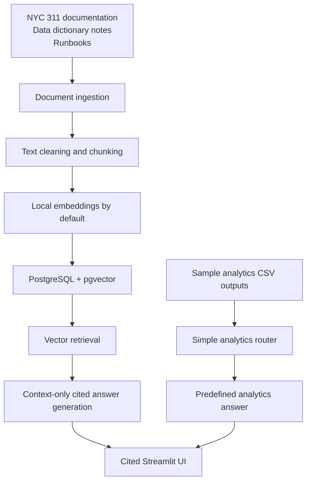

# CivicLens RAG - NYC 311 Operations Copilot

[](https://github.com/rihua-tech/civiclens-rag-nyc311/actions/workflows/ci.yml)

CivicLens RAG is a local AI Data Engineering / Hybrid RAG portfolio project that extends an NYC 311 Lakehouse concept with a curated NYC 311 field guide, section-aware cited document search, PostgreSQL + pgvector retrieval, simple predefined analytics summaries, and a local Streamlit UI.

The project is designed to show how an operational data platform can pair documentation retrieval with lightweight analytics answers while keeping outputs grounded, cited, and honest about current limitations.

## Quick Proof Summary

- Local Streamlit app runs with cited RAG answers and sample analytics answers.
- PostgreSQL + pgvector stores and retrieves embedded document chunks.
- A version-controlled source manifest validates provenance and normalized content hashes.
- Markdown chunks preserve section titles, heading paths, stable IDs, and source metadata.
- Local evaluation passes 18/18 RAG and analytics checks.
- GitHub Actions runs offline-safe pytest and compileall checks.
- No deployment, live NYC 311 data, default OpenAI calls, or production text-to-SQL claims.

## Why This Project Matters

This project demonstrates:

- Data engineering foundation: ingestion, chunking, SQL schema, Dockerized PostgreSQL, and local validation.
- RAG system design: curated documents become searchable chunks with metadata and citations.
- Vector retrieval: PostgreSQL + pgvector stores and retrieves embedded chunks.
- Hybrid analytics pattern: documentation questions use vector retrieval, while analytics questions use predefined sample outputs.
- Evaluation and safety: tests check citations, retrieval behavior, analytics routing, and safe no-answer behavior.

## Hybrid RAG Architecture


```mermaid
flowchart TD
    docs["NYC 311 documentation<br/>Data dictionary notes<br/>Runbooks"]
    sampleAnalytics["Sample analytics CSV outputs"]

    docs --> ingestion["Document ingestion"]
    ingestion --> chunking["Text cleaning and chunking"]
    chunking --> embeddings["Local embeddings by default"]
    embeddings --> pgvector["PostgreSQL + pgvector"]
    pgvector --> retrieval["Vector retrieval"]
    retrieval --> answer["Context-only cited answer generation"]
    answer --> ui["Cited Streamlit UI"]

    sampleAnalytics --> analyticsRouter["Simple analytics router"]
    analyticsRouter --> analyticsAnswer["Predefined analytics answer"]
    analyticsAnswer --> ui
```

This architecture uses vector retrieval for documentation questions and predefined sample analytics outputs for structured analytics questions.

Evaluation, pytest, and GitHub Actions validate retrieval behavior, citation coverage, analytics routing, and safe no-answer responses.

## Data Sources

The Phase 2 knowledge foundation uses a small curated set of local source documents and sample analytics outputs:

- `docs/knowledge/nyc311-service-request-fields.md`, derived from official NYC Open Data and NYC311 references
- `docs/knowledge/civiclens-lakehouse-runbook.md`, clearly labeled as CivicLens project documentation
- Project README, architecture, source, RAG design, and evaluation notes
- Small sample CSV outputs in `data/sample_outputs/`

`docs/knowledge/source-manifest.json` is the authoritative default ingestion inventory. It records source category, path/URL, version or retrieval date, and a normalized SHA-256 content hash. The Python ingestion API still accepts an explicit `source_paths` override for tests and compatible local workflows.

The project does not ingest millions of raw NYC 311 records into the vector database. Structured metrics stay in SQL examples or small sample CSV outputs instead of being dumped into vector storage. See `docs/data-sources.md` for official source links and interpretation limits.

## How RAG Works

1. Manifest-authorized source documents are hash-validated and loaded into a processed document store.
2. Markdown is split within heading sections; plain text uses a compatible fallback.
3. Stable document/chunk IDs, heading context, provenance, normalized content hashes, ingestion time, and `word_count` are preserved.
4. Embeddings are generated locally by default with the existing deterministic embedding function.
5. Chunks, metadata, and embeddings are stored in PostgreSQL + pgvector.
6. A user question is embedded with the same local embedding path.
7. Relevant chunks and their section/source metadata are retrieved from pgvector.
8. A context-only answer is generated from retrieved chunks.
9. The UI displays the answer, source citations, and an optional retrieved chunk preview.

OpenAI-backed embeddings or answers are optional and disabled by default.

## Hybrid RAG Design

CivicLens uses a simple hybrid pattern:

- Documentation questions use vector retrieval over curated project documents.
- Simple analytics questions use predefined sample CSV outputs.
- The analytics path is a small keyword router, not a production text-to-SQL agent.

In the current phase, "Hybrid RAG" means document RAG plus predefined analytics routing. Dense + lexical hybrid retrieval is planned for the next Advanced RAG stage and is not implemented yet.

This keeps the local demo predictable and offline-friendly while still showing how RAG and analytics can work together in an operations copilot.

## Database Schema

The local PostgreSQL schema includes:

- `documents`: stable document ID, source provenance, normalized content hash, and ingestion timestamp.
- `chunks`: stable chunk ID, section/heading context, source provenance, normalized content hash, `word_count`, and pgvector embedding.
- `queries`: a table reserved for logging user questions in future local experiments.
- `retrieval_results`: a table reserved for storing retrieved chunk metadata and scores in future evaluation work.

## Local Setup

Create a local `.env` from `.env.example` if you need to override defaults. Do not commit `.env`.

```bash
docker compose up -d
python -m src.ingestion.load_documents
python -m src.chunking.chunk_documents
python -m src.embeddings.embed_chunks
python -m src.evaluation.evaluate_rag
streamlit run app/streamlit_app.py
python -m pytest -q
python -m compileall app src tests
```

`docker-compose.yml` starts PostgreSQL with pgvector using safe local defaults. The local evaluation command requires the database-backed retrieval path to be prepared with ingestion, chunking, and embeddings.

Ingestion fails on a missing source or content-hash mismatch in the default manifest. Review intentional source changes and update the manifest hash before rerunning. `sql/schema.sql` safely adds Issue 8 metadata columns to an existing local database with idempotent `ADD COLUMN IF NOT EXISTS` statements; rerun ingestion, chunking, and embedding afterward. Retrieval ignores legacy chunk rows without current content hashes. The general migration framework remains deferred to Issue 13.

## Example Questions

- What is the NYC 311 Lakehouse architecture?
- What is the no-answer rule?
- What are the top complaint types?
- Which borough has the highest complaint volume?
- What does complaint_type mean?
- What is a random unsupported question?

## Evaluation Summary

Local evaluation currently uses 18 questions from `data/evaluation/rag_test_questions.csv`.

Most recent local validation:

- 18/18 evaluation questions passed locally.
- Unit tests passed locally.
- Evaluation covers document/RAG answers, citation coverage, analytics routing, safe no-answer behavior, and raw markdown clutter checks.

This is a basic local regression check, not a production reliability benchmark.

## CI

GitHub Actions runs offline-safe checks only:

```bash
python -m pytest -q
python -m compileall app src tests
```

CI does not require Docker, `.env`, OpenAI credentials, a live database, external APIs, or raw NYC 311 datasets.

## Screenshots

These screenshots are captured from a local Streamlit run.

### Local Streamlit UI


### Sample Analytics Answer


## Limitations

- Local project only.
- Not deployed.
- Not connected to live NYC 311 data.
- No default OpenAI calls.
- Simple analytics router, not production text-to-SQL.
- Small curated documents and sample outputs only.
- Official source material is a curated field guide, not a live or complete copy of NYC 311 Open Data.
- Evaluation is lightweight and does not use an LLM judge.

## Future Work

- Add real local semantic embeddings, PostgreSQL lexical retrieval, hybrid fusion, and bounded reranking.
- Expand evaluation coverage with retrieval metrics and reproducible reports.
- Harden the existing opt-in OpenAI answer path with grounding and citation validation.
- Add a versioned FastAPI application layer and reusable question orchestration.
- Add privacy-conscious observability, feedback, and controlled database migrations.
- Package the UI, API, and PostgreSQL/pgvector stack with Docker Compose.
- Add a small cloud deployment proof.
- Add safe typed analytics tools and a bounded LangGraph workflow.
- Optionally demonstrate vector-store and RAG-framework portability.

## Tech Stack

- Python
- Streamlit
- PostgreSQL
- pgvector
- Docker
- SQL
- pytest
- GitHub Actions
- Optional OpenAI API integration, disabled by default

## Repository Structure

<details>
<summary>View repository structure</summary>

```text
civiclens-rag-nyc311/
|-- app/
|   `-- streamlit_app.py
|-- data/
|   |-- evaluation/
|   |-- processed/
|   |-- raw/
|   `-- sample_outputs/
|-- docs/
|   |-- architecture.md
|   |-- data-sources.md
|   |-- evaluation-notes.md
|   |-- knowledge/
|   |   |-- civiclens-lakehouse-runbook.md
|   |   |-- nyc311-service-request-fields.md
|   |   `-- source-manifest.json
|   |-- portfolio-card.md
|   `-- rag-design.md
|-- sql/
|   |-- sample_queries.sql
|   `-- schema.sql
|-- src/
|   |-- analytics/
|   |-- chunking/
|   |-- common/
|   |-- embeddings/
|   |-- evaluation/
|   |-- generation/
|   |-- ingestion/
|   `-- retrieval/
|-- tests/
|-- docker-compose.yml
|-- requirements.txt
`-- README.md
```

</details>
