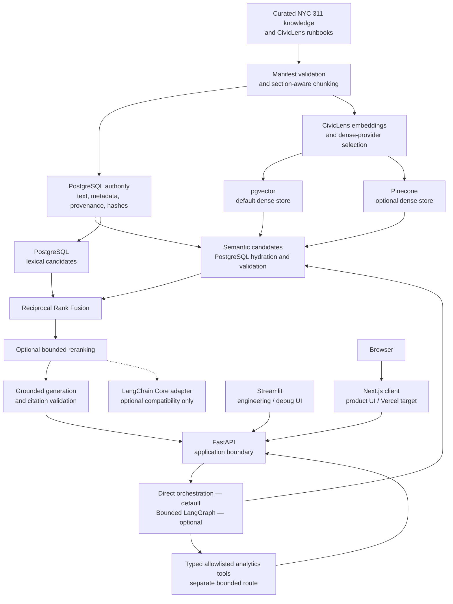
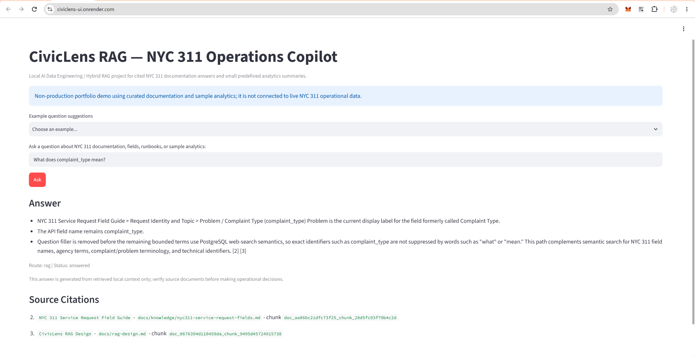

# CivicLens RAG - NYC 311 Operations Copilot

[](https://github.com/rihua-tech/civiclens-rag-nyc311/actions/workflows/ci.yml)

## What is CivicLens?

CivicLens is a non-production AI Engineering and RAG Engineering portfolio project built on a curated NYC 311 knowledge corpus. It combines section-aware ingestion, semantic and PostgreSQL lexical retrieval, Reciprocal Rank Fusion (RRF), grounded generation, and validated citations behind FastAPI. A recruiter-facing Next.js product UI and the existing Streamlit engineering UI both consume that public contract; PostgreSQL + pgvector and native CivicLens RAG remain the defaults. The repository also demonstrates bounded analytics tools and orchestration, reproducible evaluation, offline-safe CI, Docker Compose, and dated cloud deployment proof on top of a strong data-engineering foundation.

## Proof at a Glance

- **Traceable knowledge:** a version-controlled source manifest validates normalized content hashes, provenance, stable document IDs, and stable section-aware chunk IDs.
- **Advanced retrieval:** dense semantic candidates and PostgreSQL full-text candidates are fused with deterministic RRF, with optional bounded cross-encoder reranking.
- **Measured behavior:** on the approved 14-question real-local retrieval subset, hybrid search reached `0.8393` Recall@5 and `0.9286` expected-source retrieval.
- **Grounded responses:** answer generation receives allow-listed evidence, while application-owned validation rejects fabricated citations and safely abstains when evidence is insufficient.
- **Controlled AI workflows:** four typed, allowlisted, read-only sample analytics tools share the FastAPI boundary with document RAG; direct orchestration is default and bounded LangGraph is optional.
- **Portable without replacement:** pgvector is the default dense store, Pinecone is opt-in, and LangChain Core is a thin optional document/retriever adapter over native CivicLens retrieval.
- **Runnable application:** Next.js provides the recruiter-facing product experience, while Streamlit remains the engineering/debug UI; both consume the versioned FastAPI contract.
- **Auditable delivery:** GitHub Actions isolates core/native, bounded LangGraph, mocked Pinecone, LangChain Core, and frontend quality paths without paid APIs or live application services.

## Architecture


```mermaid
flowchart TD
    sources["Curated NYC 311 knowledge<br/>and CivicLens runbooks"]
    ingestion["Manifest validation<br/>and section-aware chunking"]
    postgres["PostgreSQL authority<br/>text, metadata, provenance, hashes"]
    embeddings["CivicLens embeddings<br/>and dense-provider selection"]
    pgvector["pgvector<br/>default dense store"]
    pinecone["Pinecone<br/>optional dense store"]
    dense["Semantic candidates<br/>PostgreSQL hydration and validation"]
    lexical["PostgreSQL<br/>lexical candidates"]
    rrf["Reciprocal Rank Fusion"]
    rerank["Optional bounded reranking"]
    grounded["Grounded generation<br/>and citation validation"]
    fastapi["FastAPI<br/>application boundary"]
    orchestration["Direct orchestration — default<br/>Bounded LangGraph — optional"]
    analytics["Typed allowlisted analytics tools<br/>separate bounded route"]
    browser["Browser"]
    nextjs["Next.js client<br/>product UI / Vercel target"]
    streamlit["Streamlit<br/>engineering / debug UI"]
    langchain["LangChain Core adapter<br/>optional compatibility only"]

    sources --> ingestion
    ingestion --> postgres
    ingestion --> embeddings
    embeddings --> pgvector
    embeddings --> pinecone
    pgvector --> dense
    pinecone --> dense
    postgres --> dense
    postgres --> lexical
    fastapi --> orchestration
    orchestration --> dense
    orchestration --> analytics
    dense --> rrf
    lexical --> rrf
    rrf --> rerank
    rerank --> grounded
    grounded --> fastapi
    analytics --> fastapi
    browser --> nextjs
    nextjs --> fastapi
    streamlit --> fastapi
    rerank -.-> langchain
```

PostgreSQL remains authoritative even when Pinecone supplies dense candidates. The analytics branch never executes arbitrary SQL or code, and the LangChain Core adapter maps native retrieval results into framework document types rather than creating a second RAG, answer, citation, or orchestration backend.

## Key Capabilities

| Area | Current capability |
|---|---|
| Data foundation | Curated NYC 311 field knowledge and project runbooks; manifest-controlled ingestion; normalized hashes; stable identities; section and heading provenance |
| Retrieval | CivicLens-generated embeddings; pgvector semantic search; PostgreSQL full-text search; deterministic RRF; optional bounded reranking |
| Grounding and safety | Context-only generation, stable chunk citations, application-owned provenance reconstruction, citation validation, and safe no-answer behavior |
| Analytics tools | Four fixed CSV-backed tools with strict typed inputs, immutable allowlisting, bounded results, read-only execution, and explicit sample-data provenance |
| Application boundary | FastAPI validation and sanitized errors; direct typed Next.js browser client; Streamlit engineering client; liveness/readiness; unchanged provider-neutral answer contract |
| Orchestration | Dependency-free direct mode by default; optional acyclic LangGraph workflow with bounded steps and one analytics-tool call maximum |
| Portability | PostgreSQL + pgvector and native CivicLens RAG by default; optional Pinecone dense retrieval and optional LangChain Core retriever/document compatibility |
| Observability | Opt-in privacy-conscious query/retrieval metadata and bounded feedback without persisting raw questions, answers, chunks, vectors, or credentials |
| Delivery | Docker Compose, ordered migrations, rerun-safe bootstrap, dated Render proof, pytest, Vitest, Ruff, ESLint, TypeScript, production builds, and offline-safe CI |

## Demo / Screenshots

### Grounded answer with validated citations



Captured during the dated August 2026 Render smoke test. This is non-production deployment evidence, not a permanent live-service or availability claim.

### Typed sample analytics result


The analytics route reads only checked-in sample CSV outputs through fixed tool definitions. See the additional [safe no-answer proof](docs/screenshots/issue15-render-safe-no-answer.png) and [local Streamlit overview](docs/screenshots/streamlit-local-ui.png).

## How RAG Works

1. The source manifest authorizes each document and validates its normalized SHA-256 content hash before ingestion.
2. Markdown is split within heading boundaries; chunks retain stable document/chunk IDs, section paths, source provenance, hashes, and chunking metadata.
3. CivicLens generates embeddings with the selected provider. The default real-local profile uses Sentence Transformers; deterministic embeddings support offline CI.
4. The selected dense store returns bounded cosine-scored candidates: pgvector by default or explicitly configured Pinecone. Pinecone IDs and scores are accepted only after PostgreSQL hydration and current-corpus validation.
5. PostgreSQL independently retrieves bounded lexical candidates with full-text search, regardless of the dense provider.
6. RRF deterministically fuses semantic and lexical rankings; an optional cross-encoder reranks only the configured candidate window.
7. Native CivicLens generation receives only the question and allow-listed retrieved evidence.
8. CivicLens validates stable chunk citations, rebuilds provenance from trusted retrieval metadata, and converts unsupported or uncited claims to the safe no-answer response.

PostgreSQL is always authoritative for document/chunk text, metadata, provenance, hashes, corpus identity, and lexical retrieval. See the [RAG design](docs/rag-design.md) for provider compatibility, score semantics, reindexing, readiness, and failure behavior.

## Quick Start

Docker Engine with Docker Compose v2 is the primary local path:

```bash
docker compose up -d --build
docker compose run --rm api python -m scripts.bootstrap
```

- Streamlit: <http://localhost:8501>
- FastAPI: <http://localhost:8000>
- API documentation: <http://localhost:8000/docs>
- Next.js product UI: <http://localhost:3000> after following the focused [frontend setup](frontend/README.md)

```bash
curl -X POST http://localhost:8000/api/v1/answer \
  -H "Content-Type: application/json" \
  -d '{"question":"What does complaint_type mean?","top_k":5}'
```

The default local semantic model may download weights on first use. For non-container setup, configuration, reindexing, readiness, teardown, and optional Pinecone smoke instructions, use the [RAG design](docs/rag-design.md), [deployment guide](docs/deployment.md), and [configuration reference](.env.example).

## Evaluation

The approved real-local Advanced RAG comparison uses a **24-question curated fixture**, with **14 retrieval-eligible questions**, section-level relevance, PostgreSQL/pgvector, and cached local models.

| Strategy | Recall@5 | MRR | Expected source |
|---|---:|---:|---:|
| Semantic | 0.6607 | 0.5857 | 0.7857 |
| Hybrid | 0.8393 | 0.7071 | 0.9286 |
| Hybrid + reranking | 0.8214 | 0.7619 | 0.9286 |

These results are a small portfolio benchmark, not evidence of production reliability, general benchmark leadership, or statistical significance. The recorded application results also expose known failures: four questions expected to abstain were answered, and one adversarial question routed to predefined analytics. CivicLens keeps those outcomes visible rather than changing labels, thresholds, questions, or retrieval behavior to improve the presentation. See the [approved evaluation report](docs/evaluation-report.md) and [methodology](docs/evaluation-notes.md).

## Tech Stack

| Layer | Technologies |
|---|---|
| AI / RAG | Python, Sentence Transformers, optional OpenAI, optional bounded LangGraph, optional LangChain Core |
| Retrieval | PostgreSQL 16, pgvector, PostgreSQL full-text search, RRF, optional cross-encoder reranking, optional Pinecone |
| Application | FastAPI, Pydantic, Uvicorn, Next.js, TypeScript, Zod, Streamlit |
| Data / operations | SQL migrations, manifest-based ingestion, Docker Compose, Render Blueprint |
| Quality | pytest, Vitest, Testing Library, Ruff, ESLint, TypeScript, compileall, GitHub Actions |

GitHub Actions validates five independent paths: **core/native** proves the Issue 18 optional packages are absent, then runs pytest, Ruff, and compileall; **bounded LangGraph** runs its routing, workflow, API, and safety suite; **optional Pinecone** installs the real SDK but uses mocked/fake service calls; **optional LangChain Core** installs the selected real framework package for adapter tests; and **frontend** runs lockfile installation, ESLint, TypeScript, mocked component/client tests, and a production Next.js build. Required tests use no paid APIs, model downloads, live Render/Vercel/Pinecone calls, or other external application services.

## Limitations

- CivicLens uses a small curated knowledge corpus and checked-in sample analytics outputs. It is not connected to live NYC 311 operational ingestion.
- The analytics route exposes four fixed, typed, read-only tools; it is not unrestricted or production text-to-SQL.
- OpenAI embeddings and answer generation are optional and disabled by default. Local model use has workstation memory/disk requirements and may require an initial model download.
- Pinecone has real-SDK tests against fakes/mocks, but no successful live Pinecone smoke test is claimed.
- The August 2026 Render evidence is dated, time-limited, non-production deployment proof. It does not establish ongoing availability.
- There is no production authentication, authorization, high availability, autoscaling, disaster recovery, rate limiting, hosted/production monitoring, retention guarantee, SLA, or production NYC service claim.
- The bounded LangGraph path is not a fully autonomous agent: it has no planner, arbitrary tools, repeated tool loop, conversational memory, or hidden reasoning trace.
- The evaluation fixture is small and includes documented abstention/routing failures; it does not establish production answer quality or reliability.
- The Next.js product UI is implemented for direct browser-to-FastAPI use and targets Vercel, but this branch does not claim a verified Vercel deployment or permanent demo URL. Streamlit remains the engineering, validation, and debugging UI.

## Deep-Dive Documentation

- [Architecture](docs/architecture.md) — component boundaries, data flow, orchestration, observability, and deployment architecture
- [RAG design](docs/rag-design.md) — ingestion, embeddings, vector providers, hybrid retrieval, grounding, citations, and operations
- [Data sources](docs/data-sources.md) — curated inventory, official provenance, manifest rules, and scope
- [Evaluation report](docs/evaluation-report.md) — approved measured baseline and known failed cases
- [Evaluation methodology](docs/evaluation-notes.md) — fixture, metrics, denominators, profiles, and commands
- [Deployment proof](docs/deployment.md) — dated Render evidence, reproduction notes, costs, and teardown limitations
- [Frontend setup](frontend/README.md) — local Next.js workflow, direct API boundary, quality commands, and Vercel configuration order
- [Framework ADR](docs/adr/001-rag-framework-selection.md) — LangChain Core versus LlamaIndex Core decision
- [Configuration](.env.example) — default and optional server-side settings

This repository is an AI Engineering / RAG Engineering portfolio system with a strong data-engineering foundation. It is intentionally scoped as an auditable, non-production demonstration rather than a live municipal service.
