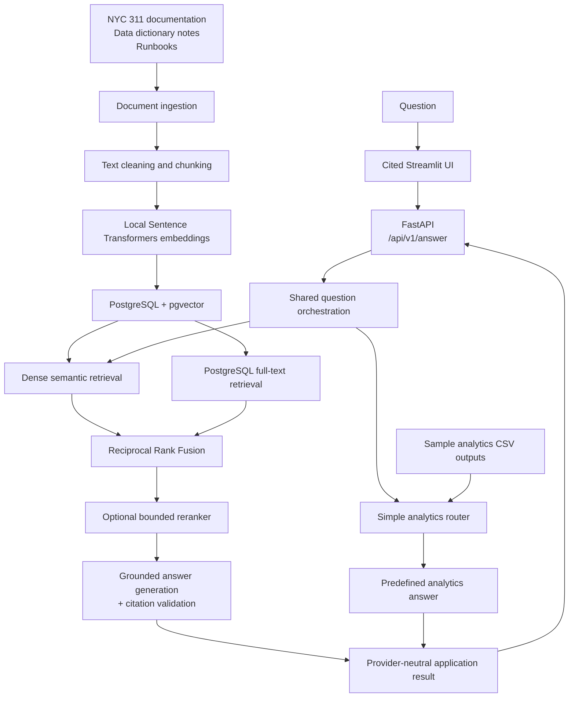
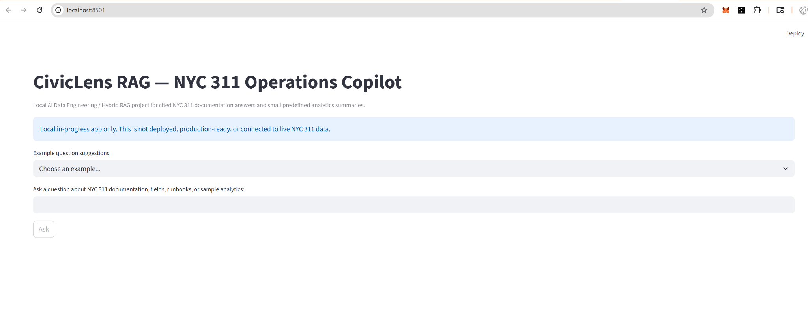
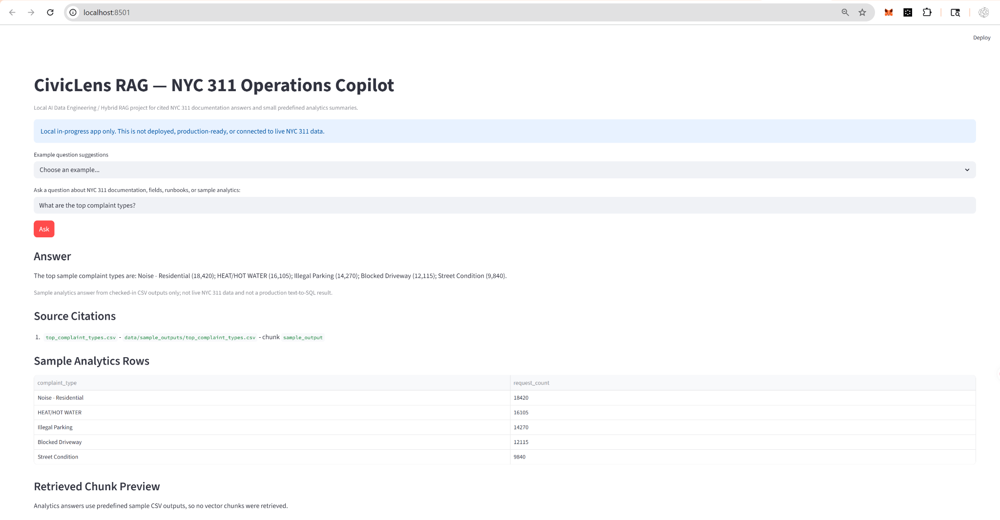

# CivicLens RAG - NYC 311 Operations Copilot

[](https://github.com/rihua-tech/civiclens-rag-nyc311/actions/workflows/ci.yml)

CivicLens RAG is a local AI Data Engineering / Hybrid RAG portfolio project that extends an NYC 311 Lakehouse concept with a curated NYC 311 field guide, section-aware cited document search, real local semantic embeddings, PostgreSQL semantic + lexical retrieval, simple predefined analytics summaries, and containerized Streamlit/FastAPI application interfaces.

The project is designed to show how an operational data platform can pair documentation retrieval with lightweight analytics answers while keeping outputs grounded, cited, and honest about current limitations.

## Quick Proof Summary

- Docker Compose runs Streamlit, FastAPI, and PostgreSQL/pgvector, with one rerun-safe bootstrap workflow for migrations and the current retrieval corpus.
- Streamlit calls the versioned FastAPI contract, while FastAPI delegates to the shared question orchestration layer for cited RAG and sample analytics answers.
- PostgreSQL + pgvector stores semantic document vectors while PostgreSQL full-text search supplies lexical candidates.
- Reciprocal Rank Fusion combines dense and lexical results, with an optional bounded local reranker.
- A version-controlled source manifest validates provenance and normalized content hashes.
- Markdown chunks preserve section titles, heading paths, stable IDs, and source metadata.
- Issue 10 provides a versioned 24-question RAG evaluation with Recall@5, MRR, routing, citation, and safe no-answer metrics.
- Issue 11 keeps local answers as the default and isolates one opt-in OpenAI answer provider behind grounded structured output and application-controlled citation validation.
- Issue 13 adds opt-in privacy-conscious execution metadata, stable `query_id` tracing, feedback, and ordered SQL migrations without storing raw questions or answers.
- GitHub Actions runs offline-safe pytest and compileall checks.
- Local Docker Compose deployment only; no cloud/production deployment, live NYC 311 data, default OpenAI calls, or production text-to-SQL claims.

## Why This Project Matters

This project demonstrates:

- Data engineering foundation: ingestion, chunking, SQL schema, Dockerized PostgreSQL, and local validation.
- RAG system design: curated documents become searchable chunks with metadata and citations.
- Hybrid retrieval: PostgreSQL + pgvector semantic search and PostgreSQL full-text search are fused deterministically with RRF.
- Hybrid analytics pattern: documentation questions use vector retrieval, while analytics questions use predefined sample outputs.
- Evaluation and safety: tests check citations, retrieval behavior, analytics routing, and safe no-answer behavior.

## Hybrid RAG Architecture


```mermaid
flowchart TD
    question["Question"]
    docs["NYC 311 documentation<br/>Data dictionary notes<br/>Runbooks"]
    sampleAnalytics["Sample analytics CSV outputs"]

    docs --> ingestion["Document ingestion"]
    ingestion --> chunking["Text cleaning and chunking"]
    chunking --> embeddings["Local Sentence Transformers embeddings"]
    embeddings --> pgvector["PostgreSQL + pgvector"]
    pgvector --> semantic["Dense semantic retrieval"]
    pgvector --> lexical["PostgreSQL full-text retrieval"]
    semantic --> fusion["Reciprocal Rank Fusion"]
    lexical --> fusion
    fusion --> reranker["Optional bounded reranker"]
    reranker --> answer["Grounded answer generation<br/>+ citation validation"]

    question --> ui["Cited Streamlit UI"]
    ui --> api["FastAPI<br/>/api/v1/answer"]
    api --> orchestrator["Shared question orchestration"]
    orchestrator --> semantic
    orchestrator --> analyticsRouter["Simple analytics router"]
    sampleAnalytics --> analyticsRouter
    analyticsRouter --> analyticsAnswer["Predefined analytics answer"]
    answer --> result["Provider-neutral application result"]
    analyticsAnswer --> result
    result --> api
```

This architecture uses semantic + lexical hybrid retrieval for documentation questions and predefined sample analytics outputs for structured analytics questions. Streamlit uses the public HTTP contract; FastAPI remains a typed, sanitized adapter over the same reusable Python orchestration used by tests and other local callers.

Evaluation, pytest, and GitHub Actions validate retrieval behavior, citation coverage, analytics routing, and safe no-answer responses.

## Data Sources

The Phase 2 knowledge foundation uses a small curated set of local source documents and sample analytics outputs:

- `docs/knowledge/nyc311-service-request-fields.md`, derived from official NYC Open Data and NYC311 references
- `docs/knowledge/civiclens-lakehouse-runbook.md`, clearly labeled as CivicLens project documentation
- Project README, architecture, source, RAG design, and evaluation notes
- Small sample CSV outputs in `data/sample_outputs/`

`docs/knowledge/source-manifest.json` is the authoritative default ingestion inventory. It records source category, path/URL, version or retrieval date, and a normalized SHA-256 content hash. The Python ingestion API still accepts an explicit `source_paths` override for tests and compatible local workflows.

The project does not ingest millions of raw NYC 311 records into the vector database. Structured metrics stay in SQL examples or small sample CSV outputs instead of being dumped into vector storage. See `docs/data-sources.md` for official source links and interpretation limits.

## How RAG Works

1. Manifest-authorized source documents are hash-validated and loaded into a processed document store.
2. Markdown is split within heading sections; plain text uses a compatible fallback.
3. Stable document/chunk IDs, heading context, provenance, normalized content hashes, ingestion time, and `word_count` are preserved.
4. The default real local provider generates 384-dimensional embeddings with `sentence-transformers/all-MiniLM-L6-v2`; deterministic embeddings remain the CI fallback.
5. Chunks, Issue 8 metadata, the active embedding profile, and vectors are stored in PostgreSQL + pgvector.
6. PostgreSQL retrieves bounded semantic and lexical candidate sets while preserving current-chunk filters.
7. Reciprocal Rank Fusion deduplicates and combines the candidates deterministically.
8. An optional local cross-encoder reranks only the configured bounded candidate set.
9. The configured answer provider receives only the question and allow-listed retrieved evidence; CivicLens validates stable chunk-ID citations before displaying provenance.

Sentence Transformers models may download on their first explicit local use. OpenAI-backed embeddings or answers remain optional and disabled by default.

## Hybrid RAG Design

CivicLens now uses two deliberately distinct hybrid patterns:

- Documentation questions use dense semantic + PostgreSQL lexical retrieval with RRF and optional bounded reranking.
- Simple analytics questions use predefined sample CSV outputs.
- The analytics path is a small keyword router, not a production text-to-SQL agent.

At the application level, "Hybrid RAG" means document RAG plus predefined analytics routing. Inside the document RAG branch, Issue 9 "hybrid retrieval" specifically means dense semantic retrieval combined with PostgreSQL lexical retrieval.

This keeps the local demo predictable and offline-friendly while still showing how RAG and analytics can work together in an operations copilot.

## Answer Providers, Grounding, and Citations

`ANSWER_PROVIDER=local` is the default. It preserves the deterministic context-only answer provider used by local workflows, evaluation, and CI. `ANSWER_PROVIDER=openai` selects the single optional commercial answer provider; the legacy `USE_OPENAI_ANSWERS=true` flag continues to select OpenAI even alongside the `.env.example` local default. Missing credentials or provider failures use a controlled local fallback, and an empty retrieval result never calls the remote provider.

The OpenAI provider uses configurable `ANSWER_MODEL`, `ANSWER_TIMEOUT_SECONDS`, and bounded `ANSWER_MAX_RETRIES` settings. It returns an application-owned structured result containing answer text, stable `chunk_id` citations, and `answered`/`abstained` status.

Retrieved text is treated as untrusted evidence. The provider is instructed not to follow instructions embedded inside retrieved documents, while application-side citation validation ensures that only retrieved chunk IDs can be accepted as citations. CivicLens accepts only citation IDs present in the retrieved result set, removes fabricated IDs, deduplicates valid IDs, and rebuilds source name/path/section/heading provenance from application-owned retrieval metadata. An allegedly answered result with zero valid citations becomes the normal safe no-answer response.

Provider-specific errors are converted to non-secret failure categories. API keys, authorization headers, database configuration, and unrelated application state are neither placed in provider content nor exposed in settings/provider representations. Automated tests and CI use mocks/fakes and make no OpenAI calls. Separate manual Issue 11 smoke verification with a real API key was completed after the code/security audit; it covered grounded answers, citation validation, abstention, and adversarial input, not a full real-LLM benchmark or production validation.

## Database Schema

The local PostgreSQL schema includes:

- `documents`: stable document ID, source provenance, normalized content hash, and ingestion timestamp.
- `chunks`: stable chunk ID, section/heading context, source provenance, normalized content hash, `word_count`, embedding provider/model/dimension, separate compatible pgvector columns, and a generated PostgreSQL full-text vector.
- `queries`: privacy-conscious execution metadata keyed by `query_id`; the legacy raw `question` column is nullable and new records leave it `NULL`.
- `retrieval_results`: retrieved chunk IDs, ranks, available dense/lexical/fusion/reranker scores, and source provenance linked to the same `query_id`.
- `feedback`: helpful/not-helpful feedback and an optional bounded comment linked to a known query.
- `schema_migrations`: applied migration versions, names, checksums, and timestamps.

## Docker Compose Demo

Docker Engine with Docker Compose v2 is the recommended demo prerequisite. Create a local `.env` from `.env.example` only when overriding runtime defaults, choose a local PostgreSQL password, and never commit that file. Secrets are supplied at container runtime; they are not copied into images or passed as build arguments.

```bash
docker compose up -d --build
docker compose run --rm api python -m scripts.bootstrap
```

The normal stack contains `postgres`, `api`, and `ui`. Inside Compose, FastAPI reaches the database at `postgres:5432` and Streamlit reaches FastAPI at `http://api:8000`; host-facing defaults remain PostgreSQL `5432`, API `8000`, and Streamlit `8501`. Both application processes bind to `0.0.0.0` inside their containers. OpenAI is disabled and the local answer provider is the default.

The one-off bootstrap command applies Issue 13 migrations, validates/loads the source manifest, builds current chunks, and creates or upserts the configured embeddings and retrieval indexes. It reuses the project modules in that order and is safe to rerun: it does not reset the database, truncate tables, delete volumes, or erase observability/feedback history. Ingestion fails on a missing source or hash mismatch. An incompatible stored embedding profile fails clearly instead of silently reindexing.

If an intentional provider/model/dimension change requires rebuilding retrieval storage, review the model choice first and run the explicit operation separately:

```bash
docker compose run --rm api python -m src.embeddings.embed_chunks --reindex
```

This is an operator-requested retrieval reindex, not part of normal bootstrap. See `docs/rag-design.md` for the complete profile-safety procedure. The default Sentence Transformers model may download weights on its first explicit bootstrap unless already cached; Compose retains that cache in a named model volume. No model weights are committed.

### Health, Readiness, and URLs

- Streamlit: `http://localhost:8501`
- FastAPI: `http://localhost:8000`
- `GET /health`: cheap process liveness used by Docker; it can return `200` before bootstrap.
- `GET /ready`: real local RAG readiness; it correctly returns `503` until the current schema, corpus, chunks, embedding profile, and indexes are prepared.

```bash
curl http://localhost:8000/health
curl http://localhost:8000/ready
```

The UI depends only on a live API and can start before RAG bootstrap. It reports unavailable, timed-out, validation, not-ready, server, and malformed-response conditions with controlled messages rather than exposing internal payloads.

### Stop, Restart, and Persistence

```bash
docker compose down
docker compose up -d
```

Normal `docker compose down` and later startup preserve PostgreSQL data in the named `postgres_data` volume and cached models in `model_cache`. Bootstrap can be rerun after restart.

**Destructive, optional cleanup:** `docker compose down -v` deletes the Compose volumes and their local database/model-cache contents. It is not part of normal shutdown or bootstrap.

## Non-Container Development

Docker is not required for the Python application processes. A host-local workflow can use any supported PostgreSQL/pgvector instance; this example starts only the existing database service and then runs the same bootstrap/API/UI boundary on the host:

```bash
docker compose up -d postgres
python -m scripts.bootstrap
uvicorn api.main:app
streamlit run app/streamlit_app.py
```

The host-local Streamlit default is `CIVICLENS_API_BASE_URL=http://localhost:8000`; Docker Compose maps the separate `CIVICLENS_DOCKER_API_BASE_URL` setting to `http://api:8000` so copying `.env.example` cannot accidentally make a container call its own localhost. `CIVICLENS_API_TIMEOUT_SECONDS` controls the UI request timeout and must be greater than zero and no more than 120 seconds. PostgreSQL and embedding/provider variables remain documented in `.env.example`. The same `python -m scripts.bootstrap` command uses host configuration and the same ordered migrations and corpus functions.

The documented offline evaluation command uses deterministic in-memory retrieval and needs no database, paid API, API key, network, or model download. The separate `--profile real` comparison requires cached local models and a prepared database.

Issue 13 database changes remain ordered files under `sql/migrations/`. Bootstrap runs their checksum-tracked migration runner on every supported fresh or upgraded database, rather than relying only on PostgreSQL's first-volume initialization directory. `0001` establishes the Issues 8/9 baseline; `0002` upgrades existing logging tables in place and adds feedback. Existing local databases do not need to be deleted or recreated.

### Local FastAPI

Start the host-local API with `uvicorn api.main:app`. It exposes:

- `GET /health` for dependency-free process liveness;
- `GET /ready` for a bounded, read-only check of PostgreSQL, the RAG schema, and current compatible embedded chunks;
- `POST /api/v1/answer` for the shared analytics/RAG question flow.
- `POST /api/v1/feedback` for helpful/not-helpful feedback linked to a known observed query.

OpenAI remains optional. Liveness and readiness never require an OpenAI key, call a paid provider, load a model, or generate an answer. Analytics requests continue to use only the predefined checked-in sample CSV outputs.

```bash
curl http://localhost:8000/health
curl http://localhost:8000/ready
curl -X POST http://localhost:8000/api/v1/answer \
  -H "Content-Type: application/json" \
  -d '{"question":"What does complaint_type mean?","top_k":5}'
curl -X POST http://localhost:8000/api/v1/feedback \
  -H "Content-Type: application/json" \
  -d '{"query_id":"<query_id from the answer>","rating":"helpful","comment":"Useful source."}'
```

The answer request accepts a nonblank `question` of at most 2,000 characters and an optional `top_k` from 1 through 100. The typed response contains `answer`, provider-neutral `route` and `status`, validated source summaries, an optional confidence note, and a `query_id` when observability is enabled. Streamlit renders that same public response. It deliberately omits raw retrieved text, provider payloads, settings, credentials, database URLs, stack traces, and internal diagnostics. Backend failures use sanitized error responses. This API is local and in progress; it is not a production deployment.

### Observability, Privacy, and Feedback

`OBSERVABILITY_ENABLED=false` is the safe default and is explicit in CI. When disabled, RAG and analytics behavior is unchanged, no query rows are written, and feedback is unavailable because there is no persisted query to reference. Set `OBSERVABILITY_ENABLED=true` only after applying migrations. `OBSERVABILITY_CONNECT_TIMEOUT_SECONDS` bounds logging and feedback database connections.

When enabled, shared orchestration creates one UUID `query_id` and carries it through the answer result. The logger uses that same ID for the query row and all retrieved-chunk rows; the API returns it so `POST /api/v1/feedback` can reference the completed execution. Logging happens outside FastAPI handlers and a logging/database failure is recorded only as an internal nonfatal status—it does not replace an otherwise successful RAG or analytics answer. If persistence fails, the public result omits `query_id` because no stored query exists for feedback. Genuine retrieval and generation failures retain their existing behavior.

Stored query metadata is limited to timestamp, route, configured retrieval strategy, embedding and answer provider/model names when applicable, answer status, reranking flag, `top_k`, question length, latency, and an observability schema version. Retrieval rows store chunk/document IDs, final and component ranks/scores that the existing pipeline actually produced, source name/type/category/path/URL/section/heading provenance, and content hashes. Feedback stores the UUID query reference, helpful/not-helpful value, optional comment of at most 1,000 characters, and timestamp.

The logger does not store raw question text, generated answer text, retrieved chunk text, embeddings, API keys, authorization headers, database credentials, environment secrets, hidden reasoning, or raw provider payloads. The legacy `queries.question` column remains only to preserve older data and is `NULL` for Issue 13 records. Feedback comments are deliberately stored as supplied user feedback, so clients should not place secrets in them. This is local diagnostic metadata, not hosted monitoring, distributed tracing, a compliance system, or a retention guarantee.

## Example Questions

- What is the NYC 311 Lakehouse architecture?
- What is the no-answer rule?
- What are the top complaint types?
- Which borough has the highest complaint volume?
- What does complaint_type mean?
- What is a random unsupported question?

## Evaluation Summary

Issue 10 uses a versioned 24-question fixture at `data/evaluation/rag_test_questions.csv`, retaining 18 Phase 1 cases and adding focused Advanced RAG cases. Section-level relevance supports multiple relevant IDs. Reports keep Recall@k, MRR, expected-source retrieval, routing, citation presence/validity, safe no-answer accuracy, and unsupported answers separate.

`python -m src.evaluation.evaluate_rag --profile offline` writes reproducible Markdown and JSON regression results under ignored `data/evaluation/results/`. Those deterministic hash-embedding scores are not a real semantic benchmark. `--profile real` separately compares the actual cached Sentence Transformers/PostgreSQL semantic, hybrid, and hybrid-plus-reranking paths when local dependencies are ready.

The reviewed portfolio baseline is `docs/evaluation-report.md`. See `docs/evaluation-notes.md` for formulas, denominators, configuration capture, commands, and limitations. This remains a small curated benchmark, not a production reliability claim or LLM-judged evaluation.

## CI

GitHub Actions runs offline-safe checks only:

```bash
python -m pytest -q
python -m compileall api app src scripts tests
```

CI explicitly uses deterministic 1536-dimensional embeddings, semantic-only retrieval, disabled reranking, the local answer provider, and disabled observability. It does not require Docker, `.env`, OpenAI credentials, a live database, external APIs, model-registry access, model-weight downloads, or raw NYC 311 datasets.

## Screenshots

These screenshots are captured from a local Streamlit run.

### Local Streamlit UI



### Sample Analytics Answer



## Limitations

- Local Docker Compose deployment/demo only; no cloud or production deployment.
- No orchestration platform, authentication, streaming, rate limiting, or production SLA.
- Not connected to live NYC 311 data.
- No default OpenAI calls.
- The opt-in OpenAI answer provider has been manually live-verified with grounded-answer, citation-validation, abstention, and adversarial-input smoke tests; automated tests and CI remain mock/offline-only.
- Local semantic and reranker models require memory/disk and may download weights on first use.
- Simple analytics router, not production text-to-SQL.
- Small curated documents and sample outputs only.
- Official source material is a curated field guide, not a live or complete copy of NYC 311 Open Data.
- Evaluation is a small curated portfolio benchmark and does not use an LLM judge.
- Observability is local and opt-in; there is no hosted dashboard, distributed tracing, alerting, retention policy, compliance guarantee, authentication, or user/session tracking.

## Future Work

- Add a small cloud deployment proof.
- Add safe typed analytics tools and a bounded LangGraph workflow.
- Optionally demonstrate vector-store and RAG-framework portability.

## Tech Stack

- Python
- Streamlit
- FastAPI and Uvicorn
- PostgreSQL
- pgvector
- PostgreSQL full-text search
- Sentence Transformers
- Docker
- SQL
- pytest
- GitHub Actions
- Optional OpenAI API integration, disabled by default

## Repository Structure

<details>
<summary>View repository structure</summary>

```text
civiclens-rag-nyc311/
|-- api/
|   |-- main.py
|   |-- models.py
|   `-- routes/
|       `-- feedback.py
|-- app/
|   |-- api_client.py
|   `-- streamlit_app.py
|-- data/
|   |-- evaluation/
|   |-- processed/
|   |-- raw/
|   `-- sample_outputs/
|-- docs/
|   |-- architecture.md
|   |-- data-sources.md
|   |-- evaluation-notes.md
|   |-- knowledge/
|   |   |-- civiclens-lakehouse-runbook.md
|   |   |-- nyc311-service-request-fields.md
|   |   `-- source-manifest.json
|   |-- portfolio-card.md
|   `-- rag-design.md
|-- sql/
|   |-- migrations/
|   |-- sample_queries.sql
|   `-- schema.sql
|-- src/
|   |-- analytics/
|   |-- chunking/
|   |-- common/
|   |-- embeddings/
|   |   `-- providers/
|   |-- evaluation/
|   |-- generation/
|   |-- ingestion/
|   |-- observability/
|   |-- orchestration/
|   `-- retrieval/
|       |-- hybrid_retriever.py
|       `-- reranker.py
|-- scripts/
|   `-- bootstrap.py
|-- tests/
|-- .dockerignore
|-- Dockerfile.api
|-- Dockerfile.ui
|-- docker-compose.yml
|-- requirements-ui.txt
|-- requirements.txt
`-- README.md
```

</details>
