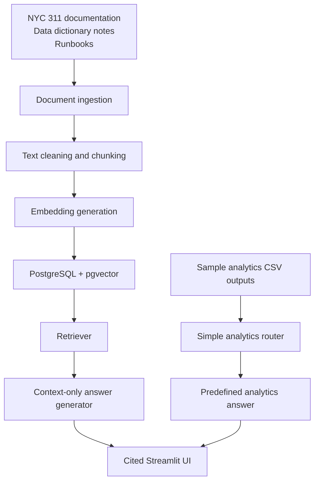

# Architecture

## CivicLens RAG - Hybrid RAG Architecture

## Design Principle

Documents and metadata are stored for retrieval. Structured metrics remain in SQL tables or small sample CSV outputs instead of being dumped into the vector database.

This is a local development architecture, not a production deployment.
