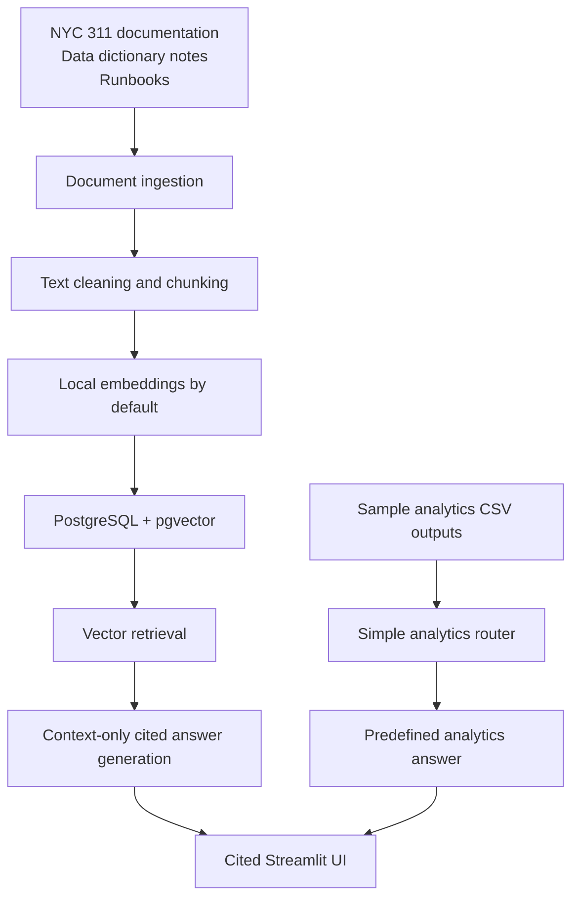

# Hybrid RAG Architecture

This architecture uses vector retrieval for documentation questions and predefined sample analytics outputs for structured analytics questions.

Evaluation, pytest, and GitHub Actions validate retrieval behavior, citation coverage, analytics routing, and safe no-answer responses.

## Design Principle

Documents and metadata are stored for retrieval. Structured metrics remain in SQL tables or small sample CSV outputs instead of being dumped into the vector database.

This is a local development architecture, not a production deployment. It is not connected to live NYC 311 data, OpenAI is optional and disabled by default, and the analytics path uses predefined sample CSV outputs rather than production text-to-SQL.
