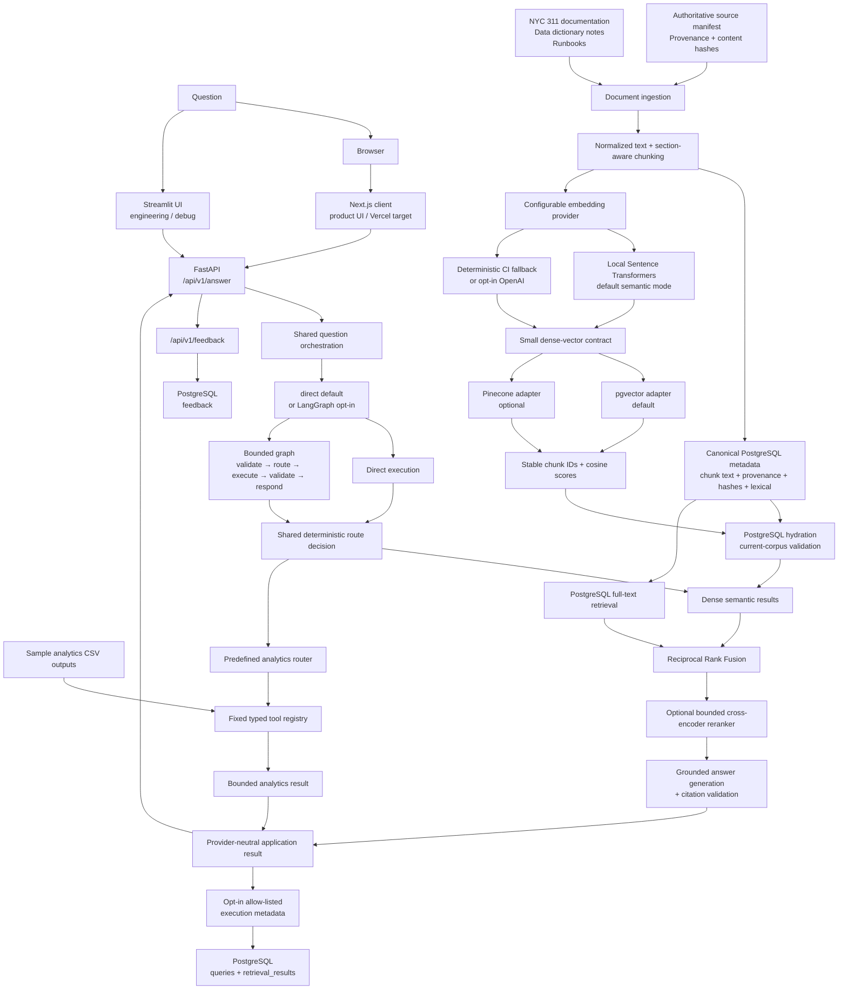

# Hybrid RAG Architecture

```mermaid
flowchart TD
    question["Question"]
    docs["NYC 311 documentation<br/>Data dictionary notes<br/>Runbooks"]
    manifest["Authoritative source manifest<br/>Provenance + content hashes"]
    samples["Sample analytics CSV outputs"]

    manifest --> ingestion
    docs --> ingestion["Document ingestion"]
    ingestion --> chunking["Normalized text + section-aware chunking"]
    chunking --> postgres["Canonical PostgreSQL metadata<br/>chunk text + provenance + hashes + lexical"]
    chunking --> provider["Configurable embedding provider"]
    provider --> semantic["Local Sentence Transformers<br/>default semantic mode"]
    provider --> fallback["Deterministic CI fallback<br/>or opt-in OpenAI"]
    semantic --> vectorContract["Small dense-vector contract"]
    fallback --> vectorContract
    vectorContract --> pgvector["pgvector adapter<br/>default"]
    vectorContract --> pinecone["Pinecone adapter<br/>optional"]
    pgvector --> vectorMatches["Stable chunk IDs + cosine scores"]
    pinecone --> vectorMatches
    vectorMatches --> hydration["PostgreSQL hydration<br/>current-corpus validation"]
    postgres --> hydration
    hydration --> dense["Dense semantic results"]
    postgres --> lexical["PostgreSQL full-text retrieval"]
    dense --> rrf["Reciprocal Rank Fusion"]
    lexical --> rrf
    rrf --> reranker["Optional bounded cross-encoder reranker"]
    reranker --> answer["Grounded answer generation<br/>+ citation validation"]

    question --> browser["Browser"]
    browser --> nextjs["Next.js client<br/>product UI / Vercel target"]
    nextjs --> api
    question --> ui["Streamlit UI<br/>engineering / debug"]
    ui --> api["FastAPI<br/>/api/v1/answer"]
    api --> orchestrator["Shared question orchestration"]
    orchestrator --> mode["direct default<br/>or LangGraph opt-in"]
    mode --> direct["Direct execution"]
    mode --> boundedGraph["Bounded graph<br/>validate → route → execute → validate → respond"]
    direct --> routeDecision["Shared deterministic route decision"]
    boundedGraph --> routeDecision
    routeDecision --> dense
    routeDecision --> analyticsRouter["Predefined analytics router"]
    analyticsRouter --> analyticsRegistry["Fixed typed tool registry"]
    samples --> analyticsRegistry
    analyticsRegistry --> analyticsAnswer["Bounded analytics result"]
    answer --> result["Provider-neutral application result"]
    analyticsAnswer --> result
    result --> api
    result --> observation["Opt-in allow-listed<br/>execution metadata"]
    observation --> postgresLogs["PostgreSQL<br/>queries + retrieval_results"]
    api --> feedback["/api/v1/feedback"]
    feedback --> postgresFeedback["PostgreSQL<br/>feedback"]
```

This source explains the CivicLens project architecture: in the NYC 311 Lakehouse design, document ingestion feeds semantic and lexical retrieval, and retrieved evidence with provenance feeds grounded cited answers. Streamlit uses the versioned FastAPI contract, and the adapter delegates to a shared question orchestrator that owns the analytics-versus-RAG decision. The orchestrator stays reusable outside HTTP.

At the application level, CivicLens still routes documentation questions to RAG and simple analytics questions to predefined sample outputs. Inside the documentation RAG path, Issue 9 hybrid retrieval means dense semantic retrieval plus PostgreSQL lexical retrieval, combined deterministically with Reciprocal Rank Fusion (RRF). The optional cross-encoder reranks only a configured candidate limit.

## Safe Typed Analytics Tool Boundary

The direct analytics router maps supported question patterns to exactly four
fixed tool IDs: `top_complaint_types`, `borough_request_volume`,
`agency_request_volume`, and `backlog_summary`. An immutable registry is the
only supported resolver. Each tool has a strict Pydantic input schema that
rejects unknown fields and coercion; ranked results accept only a bounded
integer limit from 1 through 10, while the fixed backlog summary accepts no
arguments.

Tools read only their hard-coded checked-in sample CSV path. They do not accept
table, column, filename, module, function, SQL, or code selections. Results
contain the stable tool ID and name, summary, tool-specific typed rows,
application-owned source provenance, and the sample/non-production disclaimer.
The current CSV files contain no source timestamp, so the optional provenance
timestamp remains unset rather than being invented. A compatibility adapter
preserves the existing FastAPI, Streamlit, observability, and evaluation result
contract. CivicLens does not implement unrestricted production text-to-SQL.

## Direct and Bounded LangGraph Orchestration

Direct execution remains the default, dependency-free reference path. The optional LangGraph mode uses the same deterministic route-decision helper, so it cannot select a different RAG or analytics capability. Its acyclic graph validates input, decides the route, executes exactly one existing RAG branch or one registered analytics tool, validates the result, and produces the existing application response. The public FastAPI contract is unchanged.

Execution has both a configurable bounded step/recursion limit and a fixed maximum of one analytics-tool call. There is no planner, multi-tool loop, LLM router, checkpointer, conversational memory, arbitrary tool resolver, or hidden reasoning state. Missing optional dependencies, invalid routes/results, registry validation failures, and exceeded limits return controlled abstention/fallback results. Valid RAG citations and analytics provenance pass through unchanged.

## Design Principle

The source manifest distinguishes curated external NYC 311 knowledge from CivicLens project documentation. Documents and section-aware chunks preserve stable IDs, source provenance, normalized content hashes, heading paths, ingestion timestamps, and `word_count` through PostgreSQL storage and retrieval. Semantic, lexical, fused, and reranked results share that metadata contract.

The normal local semantic provider is `sentence-transformers/all-MiniLM-L6-v2`, which produces 384-dimensional vectors. It is a compact English sentence/paragraph model suitable for this small curated corpus. The deterministic 1536-dimensional provider remains available for tests and offline-safe CI, while the existing OpenAI embedding path remains opt-in.

The default pgvector adapter uses the existing two dimension-specific columns, and stored rows record provider, model, and dimension. The optional Pinecone adapter targets an operator-created cosine index with the exact configured dimension and stores CivicLens vectors under a deterministic current-corpus namespace. Both providers preserve stable chunk IDs, cosine scores, ranks, candidate limits, minimum similarity, and deterministic ordering. There is exactly one selected provider per process; no dual write or fallback occurs.

PostgreSQL remains authoritative regardless of vector-provider selection. Bootstrap commits document/chunk text, provenance, corpus hashes, and lexical data before vector synchronization. Dense matches are only IDs, scores, and consistency metadata until PostgreSQL hydration proves that every result belongs to the current corpus. Pinecone never replaces lexical retrieval, RRF, reranking, generation, citation validation, observability, or orchestration.

ADR 001 selects LangChain Core over LlamaIndex Core for the only Issue 18 framework adapter. The adapter lazily exposes native CivicLens retrieval as LangChain `BaseRetriever`/`Document` types and maps stable identity, source metadata, score, and rank. It does not introduce a LangChain RAG, answer, citation, or agent path. Native CivicLens remains the default, and external framework-generated answers do not inherit CivicLens citation-validation or abstention guarantees.

FastAPI is a thin, provider-neutral HTTP boundary: it validates requests, calls the shared orchestration layer, serializes allow-listed answer/source fields, and sanitizes errors. It does not duplicate retrieval, analytics, grounding, or citation logic. `/health` is dependency-free liveness; `/ready` always checks PostgreSQL metadata/lexical state and read-only compatibility/completeness of the selected dense-vector provider without loading models, generating answers, or mutating data. Pinecone checks use configured bounded SDK timeouts/retries.

## Next.js Portfolio Product Boundary

Issue 19 adds a dedicated `frontend/` Next.js and TypeScript application as the recruiter-facing product interface. The hydrated browser client sends `POST /api/v1/answer` directly to the configured Render FastAPI origin; there is no Next.js route handler, Server Action, Vercel AI SDK, JavaScript RAG implementation, or server-side answer proxy. `NEXT_PUBLIC_CIVICLENS_API_BASE_URL` contains only the public FastAPI origin. No database URL, provider key, model configuration, or other backend secret is exposed through browser configuration.

The frontend owns presentation and one small typed HTTP client. Zod validates successful answer responses and sanitized error responses at runtime before React renders them. The UI distinguishes answered RAG, answered approved analytics, safe abstention, and operational failure. It displays only backend-returned answer text and provenance, preserves citation numbers without renumbering, keeps optional chunk/query IDs secondary, and never reconstructs internal analytics rows, retrieval chunks, citations, or source URLs.

Because the answer request crosses browser origins, FastAPI uses narrowly scoped CORS middleware. `CIVICLENS_CORS_ALLOWED_ORIGINS` is a comma-separated server-side allowlist with a localhost-only development default. Wildcards, credentials, URL paths, and non-HTTP(S) origins are rejected. The middleware allows only the `POST` method and `Content-Type` request header needed by the frontend, with credentials disabled. CORS controls browser response access; it is not authentication or production authorization.

The frontend is designed for Vercel, but a hosted deployment is accepted only after a real stable production origin exists, that exact origin is added to the Render CORS setting, FastAPI is restarted/redeployed, and browser smoke tests pass. Until then, the repository claims only the locally validated implementation and production build. Streamlit remains available as the engineering, validation, and debugging interface through the same FastAPI contract.

## Local Container Boundary

Docker Compose packages three local services: `ui` (Streamlit), `api` (FastAPI), and `postgres` (PostgreSQL/pgvector). Service-to-service traffic uses Compose DNS (`ui` to `api:8000`, API to `postgres:5432`), while host ports remain configurable. API container health uses `/health`, not `/ready`; therefore the UI and API can run while the corpus is still unprepared and `/ready` correctly reports `503`.

The one-off `python -m scripts.bootstrap` workflow reuses the Issue 13 migration runner, manifest ingestion, section-aware chunking, canonical PostgreSQL persistence, embedding, selected-provider synchronization, and compatibility verification in order. Normal reruns use stable IDs and upserts and never request destructive reindexing. Provider failures stop bootstrap rather than falling back. PostgreSQL and the local model cache use named volumes. Runtime environment variables supply configuration and optional credentials; Dockerfiles contain no secrets or build-time secret arguments.

## Render Cloud Deployment Boundary

Issue 15 reuses the same containers and application boundaries for a dated
Render portfolio demo: public Streamlit calls the public FastAPI contract, and
FastAPI uses Render's internal connection to the existing managed
PostgreSQL/pgvector database. The API startup script runs the same ordered,
rerun-safe bootstrap before Uvicorn. The cloud profile uses deterministic
1536-dimensional embeddings, hybrid retrieval without reranking, local answer
generation, and disabled observability/OpenAI paths.

On 2026-08-22 EDT, the Render API and Streamlit health checks were live,
`/ready` returned `200`, a supported question returned validated stable-chunk
provenance, and an unsupported question safely abstained. The public demo URLs
and dated evidence are recorded in `docs/deployment.md`. This verifies one
cloud deployment path; it does not establish high availability, autoscaling,
production authentication, backups, an SLA, or a production NYC service.

Issue 19 keeps that Render API and database path unchanged. Once configured,
the Vercel-hosted Next.js client is an additional public browser consumer of
the same Render FastAPI origin; it does not replace the dated Streamlit proof
or move any retrieval, analytics, generation, citation, or data responsibility
to Vercel.

## Observability and Feedback Boundary

Shared orchestration, not FastAPI, creates one `query_id` when `OBSERVABILITY_ENABLED=true`. The same ID is returned with the answer, stored on the existing `queries` row, attached to allow-listed `retrieval_results` rows, and required by feedback. PostgreSQL writes are parameterized and logging failures are isolated from otherwise successful answers. The feedback route delegates query validation and persistence to the observability service.

Only execution metadata, existing retrieval scores/ranks, stable source references, and bounded feedback are stored. Issue 17 adds allow-listed orchestration mode, step count, tool-call count, and outcome fields; it does not persist graph state or planning traces. Raw question and answer text, retrieved chunk text, vectors, secrets, authorization data, environment configuration, hidden reasoning, and provider payloads are excluded. Ordered checksummed SQL files migrate existing tables without an ORM or database reset.

This local-first architecture includes Docker Compose, a locally validated Next.js product UI, and one dated non-production Render portfolio deployment. A Vercel deployment is not claimed until separately completed and verified. The system is not connected to live NYC 311 data, OpenAI is optional and disabled by default, and the analytics path remains predefined rather than production text-to-SQL. The optional bounded graph is not an unrestricted autonomous agent. Hosted observability, distributed tracing, dashboards, alerting, retention guarantees, authentication, production cloud operations, streaming, rate limiting, and monitoring remain out of the demonstrated scope.
