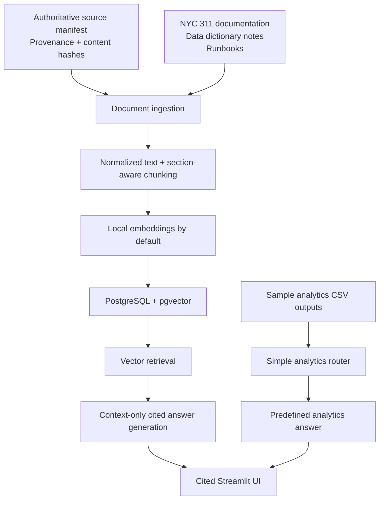

# Hybrid RAG Architecture

```mermaid
flowchart TD
    docs["NYC 311 documentation<br/>Data dictionary notes<br/>Runbooks"]
    manifest["Authoritative source manifest<br/>Provenance + content hashes"]
    samples["Sample analytics CSV outputs"]

    manifest --> ingestion
    docs --> ingestion["Document ingestion"]
    ingestion --> chunking["Normalized text + section-aware chunking"]
    chunking --> embeddings["Local embeddings by default"]
    embeddings --> store["PostgreSQL + pgvector"]
    store --> retrieval["Vector retrieval"]
    retrieval --> answer["Context-only cited answer generation"]
    answer --> ui["Cited Streamlit UI"]

    samples --> router["Simple analytics router"]
    router --> analyticsAnswer["Predefined analytics answer"]
    analyticsAnswer --> ui
```

This architecture uses vector retrieval for documentation questions and predefined sample analytics outputs for structured analytics questions.

Evaluation, pytest, and GitHub Actions validate retrieval behavior, citation coverage, analytics routing, and safe no-answer responses.

## Design Principle

The source manifest distinguishes curated external NYC 311 knowledge from CivicLens project documentation. Documents and section-aware chunks preserve stable IDs, source provenance, normalized content hashes, heading paths, ingestion timestamps, and `word_count` through PostgreSQL storage and retrieval. Structured metrics remain in SQL tables or small sample CSV outputs instead of being dumped into the vector database.

This is a local development architecture, not a production deployment. It is not connected to live NYC 311 data, OpenAI is optional and disabled by default, and the analytics path uses predefined sample CSV outputs rather than production text-to-SQL.
