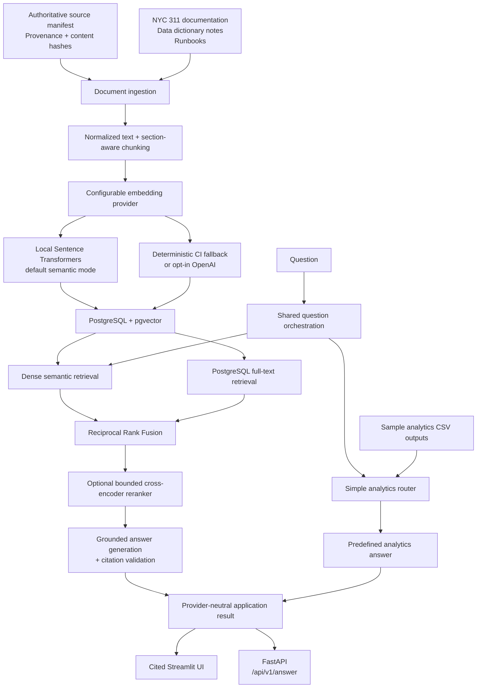

# Hybrid RAG Architecture

```mermaid
flowchart TD
    question["Question"]
    docs["NYC 311 documentation<br/>Data dictionary notes<br/>Runbooks"]
    manifest["Authoritative source manifest<br/>Provenance + content hashes"]
    samples["Sample analytics CSV outputs"]

    manifest --> ingestion
    docs --> ingestion["Document ingestion"]
    ingestion --> chunking["Normalized text + section-aware chunking"]
    chunking --> provider["Configurable embedding provider"]
    provider --> semantic["Local Sentence Transformers<br/>default semantic mode"]
    provider --> fallback["Deterministic CI fallback<br/>or opt-in OpenAI"]
    semantic --> pgvector["PostgreSQL + pgvector"]
    fallback --> pgvector
    pgvector --> dense["Dense semantic retrieval"]
    pgvector --> lexical["PostgreSQL full-text retrieval"]
    dense --> rrf["Reciprocal Rank Fusion"]
    lexical --> rrf
    rrf --> reranker["Optional bounded cross-encoder reranker"]
    reranker --> answer["Grounded answer generation<br/>+ citation validation"]

    question --> orchestrator["Shared question orchestration"]
    orchestrator --> dense
    orchestrator --> router["Simple analytics router"]
    samples --> router
    router --> analyticsAnswer["Predefined analytics answer"]
    answer --> result["Provider-neutral application result"]
    analyticsAnswer --> result
    result --> ui["Cited Streamlit UI"]
    result --> api["FastAPI<br/>/api/v1/answer"]
```

This source explains the CivicLens project architecture: in the NYC 311 Lakehouse design, document ingestion feeds semantic and lexical retrieval, and retrieved evidence with provenance feeds grounded cited answers. A shared question orchestrator owns the analytics-versus-RAG decision and returns one application result to either Streamlit or the versioned FastAPI adapter.

At the application level, CivicLens still routes documentation questions to RAG and simple analytics questions to predefined sample outputs. Inside the documentation RAG path, Issue 9 hybrid retrieval means dense semantic retrieval plus PostgreSQL lexical retrieval, combined deterministically with Reciprocal Rank Fusion (RRF). The optional cross-encoder reranks only a configured candidate limit.

## Design Principle

The source manifest distinguishes curated external NYC 311 knowledge from CivicLens project documentation. Documents and section-aware chunks preserve stable IDs, source provenance, normalized content hashes, heading paths, ingestion timestamps, and `word_count` through PostgreSQL storage and retrieval. Semantic, lexical, fused, and reranked results share that metadata contract.

The normal local semantic provider is `sentence-transformers/all-MiniLM-L6-v2`, which produces 384-dimensional vectors. It is a compact English sentence/paragraph model suitable for this small curated corpus. The deterministic 1536-dimensional provider remains available for tests and offline-safe CI, while the existing OpenAI embedding path remains opt-in.

The two vector dimensions use separate pgvector columns, and stored rows record provider, model, and dimension. Retrieval rejects unrecorded, mixed, or incompatible profiles instead of treating their vectors as interchangeable. Changing model or dimension requires a full, explicit re-embedding/reindex operation described in `docs/rag-design.md`.

FastAPI is a thin, provider-neutral HTTP boundary: it validates requests, calls the shared orchestration layer, serializes allow-listed answer/source fields, and sanitizes errors. It does not duplicate retrieval, analytics, grounding, or citation logic. `/health` is dependency-free liveness; `/ready` cheaply checks the local PostgreSQL RAG schema and compatible current embedded corpus without loading models, calling OpenAI, generating answers, or mutating data.

This is a local development architecture, not a production deployment. It is not connected to live NYC 311 data, OpenAI is optional and disabled by default, and the analytics path remains predefined rather than production text-to-SQL. Persistent logging, feedback, authentication, deployment, streaming, rate limiting, and monitoring remain later-stage work.
